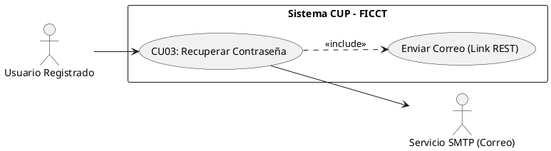
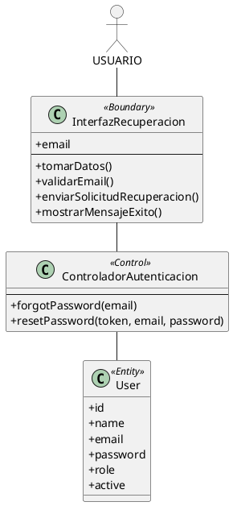

Segun estuve observando, tenemos errores en el sistema corrigue basandote en lo siguiente
#### CU03: Recuperar Contraseña por Correo Electrónico

**A. Estructura del Modelo de CU (Diagrama Específico)**


**B. Ficha de Especificación del Caso de Uso**
| **CASO DE USO**     | CU03 — Recuperar Contraseña por Correo Electrónico.
| **PROPÓSITO**       | Permitir que un usuario que olvidó su contraseña pueda restablecerla de forma segura sin intervención del administrador.
| **DESCRIPCIÓN**     | El usuario solicita un enlace de restablecimiento ingresando su correo registrado. El sistema envía un token temporal de un solo uso al correo indicado. Al hacer clic en el enlace, el usuario es redirigido a un formulario donde establece su nueva contraseña cumpliendo las políticas de seguridad.
| **ACTORES**         | Tablas de BD (`usuarios`), Servicio SMTP de correo.
| **ACTOR INICIADOR** | Cualquier usuario registrado.                                                                                     
| **PRECONDICIÓN**    | El correo electrónico debe existir en la tabla `usuarios` con estado "Activo".                                                                                       
| **FLUJO PRINCIPAL** | 1. El actor hace clic en "¿Olvidó su contraseña?" en la pantalla de login. 2. El sistema despliega un formulario solicitando el correo electrónico. 3. El actor ingresa su correo y presiona "Enviar enlace". 4. El sistema verifica que el correo exista en la BD. 5. El sistema genera un token de restablecimiento (válido 1 hora) y lo envía al correo. 6. El actor accede a su correo, hace clic en el enlace recibido. 7. El sistema valida el token y despliega el formulario de nueva contraseña. 8. El actor ingresa la nueva contraseña (mínimo 8 caracteres, mayúsculas, minúsculas y números) y la confirma. 9. El sistema actualiza el hash en la BD e invalida el token usado. 10. El sistema redirige al login con mensaje: "Contraseña actualizada exitosamente". |
| **POST CONDICIÓN**  | La contraseña anterior queda invalidada. El token utilizado no puede reutilizarse.                                                                                   
| **EXCEPCIONES**     | *E1: Correo no registrado.* El sistema muestra un mensaje genérico (por seguridad): "Si el correo existe en nuestro sistema, recibirá un enlace de recuperación". *E2: Token expirado.* El sistema muestra: "Este enlace ha expirado. Solicite uno nuevo".        

#### Realización de Análisis para CU03: Recuperar Contraseña (DIAGRAMA DE COMUNICACION)

**Descripción detallada de la colaboración y dinámica:**
El *Usuario* que ha olvidado su contraseña ingresa su correo electrónico en la `InterfazRecuperacion`. La frontera envía la solicitud al `ControladorAuth`, quien consulta en la entidad `Usuario` si existe una cuenta registrada con ese correo. Si el correo existe, el controlador genera internamente un token de restablecimiento y envía un enlace de recuperación al correo del usuario mediante un auto-mensaje (`sendResetLink`). Por seguridad, independientemente de si el correo existe o no, la interfaz muestra un mensaje genérico de confirmación para evitar la enumeración de cuentas.


##### CU03: Recuperar Contraseña por Correo Electrónico  (diagrama de analisis)

#### 3. Diagrama de Secuencia para CU03: Recuperar Contraseña

```plantuml
@startuml Seq_CU03
skinparam actorStyle awesome
skinparam backgroundColor transparent

actor "Usuario" as Act
participant "IU_Recuperacion" as B_Int
participant "CTR_Auth" as C_Ctrl
participant "CE_Usuario" as E_Usu

Act -> B_Int : 1: + IngresarCorreo(correo)
activate B_Int
B_Int -> C_Ctrl : 2: + forgotPassword(email)
activate C_Ctrl
C_Ctrl -> E_Usu : 3: + where('email', email)
activate E_Usu
E_Usu --> C_Ctrl : 4: + DatosExistencia
deactivate E_Usu
C_Ctrl -> C_Ctrl : 5: + sendResetLink()
C_Ctrl --> B_Int : 6: + ConfirmarEnvio()
deactivate C_Ctrl
B_Int --> Act : 7: + MostrarMensajeExito()
deactivate B_Int
@enduml
 
 Corrigue todo en base a esto el CU03 ya que segun vi, ns porque pero no me llega algo para restablecer la contraseña
