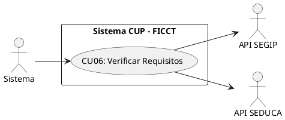
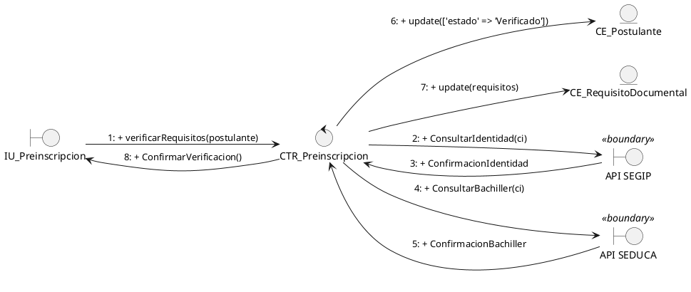
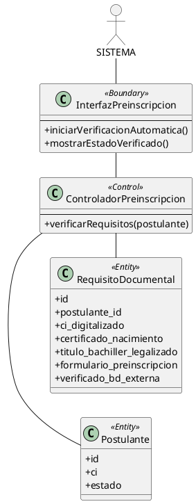
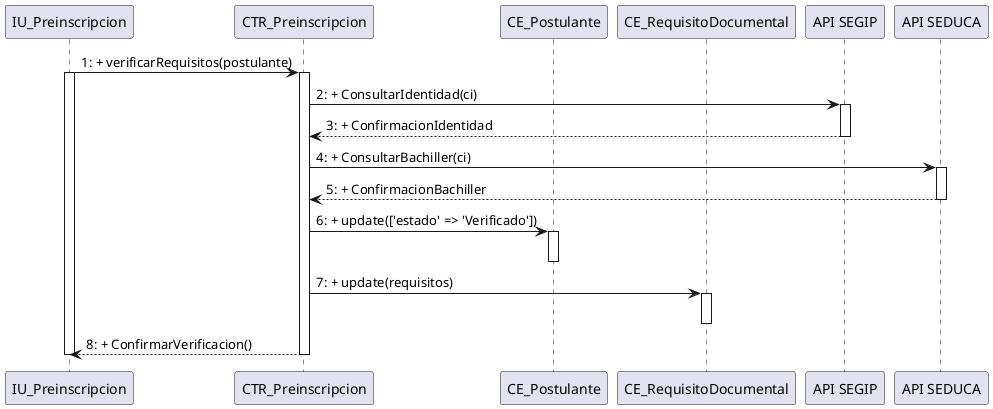
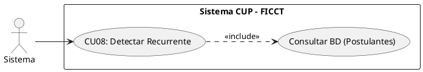
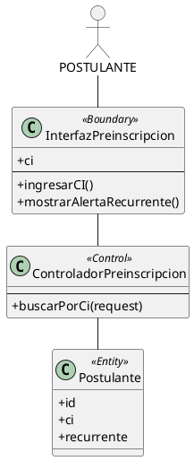
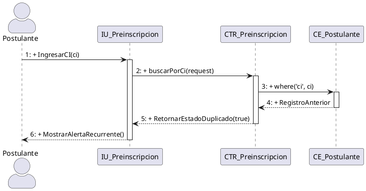
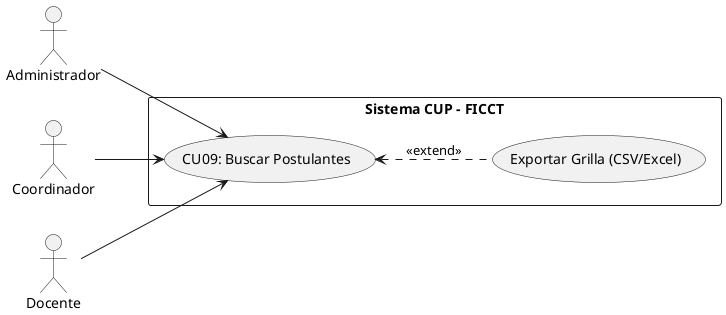
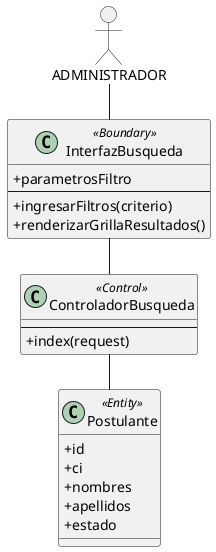
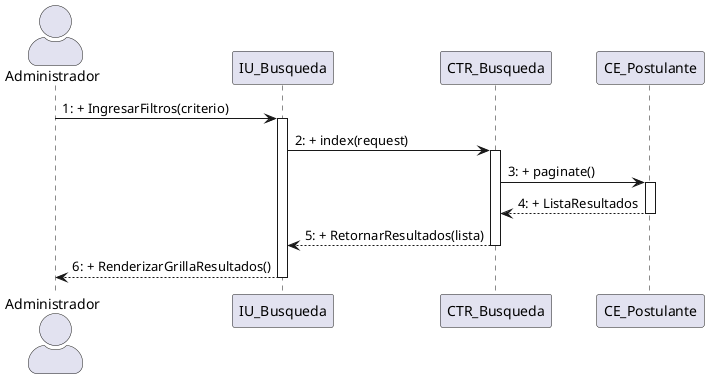

necesito que corrigas todos estos casos de uso basandote en lo siguiente : 

#### CU06: Verificar Requisitos Automáticamente (BD Externa SEGIP/SEDUCA)
COMO SABEMOS NO TENEMOS ACCESO AL SEGUIP PERO ESTAMOS HACIENDO UNA SIMULACION
**A. Estructura del Modelo de CU (Diagrama Específico)**

**B. Ficha de Especificación del Caso de Uso**

| **CASO DE USO**     | CU06 — Verificar Requisitos Automáticamente (BD Externa).
| **PROPÓSITO**       | Garantizar la veracidad de la identidad y el título de bachiller del postulante conectándose a bases de datos externas, antes de habilitarlo para el pago.
| **DESCRIPCIÓN**     | Se ejecuta automáticamente en segundo plano tras hacer clic en "Siguiente" en la pantalla de verificación de datos (CU05), mostrando una pantalla de carga con el mensaje: "Verificando datos con el SEGIP o las entidades que hay que verificar". El sistema realiza consultas automáticas a los servicios web de SEGIP y SEDUCA. Si se valida la identidad y la emisión del título de bachiller, se redirige al postulante al proceso de pago (CU07).
| **ACTORES**         | API SEGIP, API SEDUCA, Tablas de BD (`postulantes`).
| **ACTOR INICIADOR** | Sistema (invocado automáticamente tras la confirmación de datos). 
| **PRECONDICIÓN**    | El postulante debe haber confirmado sus datos en la pantalla de verificación de CU05. 
| **FLUJO PRINCIPAL** | 1. El sistema despliega la pantalla de carga con el mensaje: "Verificando datos con el SEGIP o las entidades que hay que verificar". 2. El sistema toma el CI y fecha de nacimiento del postulante. 3. Ejecuta una petición HTTP a la API del SEGIP para validar la identidad. 4. Ejecuta una petición a la API del SEDUCA para verificar la emisión del título de bachiller. 5. Si ambas APIs retornan confirmación positiva, el sistema marca los requisitos como "Validados Automáticamente", actualiza el estado del postulante a "Verificado" y lo redirige automáticamente a la pasarela de pagos (CU07). |
| **POST CONDICIÓN**  | El postulante queda marcado como "Verificado" y es redirigido automáticamente a la pasarela de pagos Stripe (CU07).
| **EXCEPCIONES**     | *E1: Datos no coinciden en SEGIP/SEDUCA.* El sistema notifica: "No se pudo validar su información automáticamente. Por favor, acérquese a las oficinas para verificación manual". *E2: API externa caída.* El sistema reintenta la validación y notifica posteriormente. 

#### Realización de Análisis para CU06: Verificar Requisitos Automáticamente (DIAGRAMA DE COMUNICACION)

**Descripción detallada de la colaboración y dinámica:**
Este caso de uso se ejecuta en segundo plano cuando el postulante presiona "Siguiente" en la pantalla de verificación de datos. El controlador `CTR_Preinscripcion` realiza peticiones HTTP a los límites externos `API SEGIP` y `API SEDUCA` para contrastar los datos. Si las respuestas son positivas, actualiza el estado de la entidad `CE_Postulante` a "Verificado" y devuelve el control para iniciar la pasarela de pagos.

#### CU06: Verificar Requisitos Automáticamente (DIAGRAMA DE ANALISIS)

#### 6. Diagrama de Secuencia para CU06: Verificar Requisitos Automáticamente (SEGIP/SEDUCA)

fin del caso de uso 06 

comienzo para el caso de uso 08

#### CU08: Detectar Postulante Recurrente por CI

**A. Estructura del Modelo de CU (Diagrama Específico)**

**B. Ficha de Especificación del Caso de Uso**

| **CASO DE USO**     | CU08 — Detectar Postulante Recurrente por CI. 
| **PROPÓSITO**       | Identificar automáticamente a postulantes que ya intentaron ingresar en gestiones anteriores, preservando su código original y su historial.
| **DESCRIPCIÓN**     | Cuando un postulante ingresa su CI durante el registro (CU05), el sistema consulta la tabla `postulantes` para verificar si ya existe un registro previo. Si se detecta un postulante recurrente, el sistema recupera su código original, su historial de intentos y le permite reutilizar sus datos personales, requiriendo únicamente un nuevo pago.  
| **ACTORES**         | Tablas de BD (`postulantes`). 
| **ACTOR INICIADOR** | Sistema (invocado automáticamente desde CU05). 
| **PRECONDICIÓN**    | El CI ingresado debe tener formato válido. 
| **FLUJO PRINCIPAL** | 1. El sistema recibe el CI ingresado por el postulante en el formulario de registro. 2. El sistema ejecuta una consulta a la BD buscando coincidencia exacta de CI. 3. Si NO existe: el sistema continúa con el flujo normal de CU05 (nuevo registro). 4. Si SÍ existe: el sistema notifica: "Se detectó un registro previo con este CI. Código de postulante: [código original]". 5. El sistema recupera los datos personales del postulante y los precarga en el formulario. 6. El postulante puede actualizar sus datos y seleccionar nuevas opciones de carrera. 7. El sistema marca la bandera `postulante_recurrente = TRUE` e incrementa el contador de intentos. |
| **POST CONDICIÓN**  | El postulante recurrente mantiene su código original. El historial de gestiones previas queda vinculado al mismo registro.
| **EXCEPCIONES**     | *E1: Postulante con máximo de intentos.* (Configurable) Si la política de la facultad limita los intentos, el sistema verifica el contador y bloquea el nuevo registro si se excede el límite. 

#### Realización de Análisis para CU08: Detectar Postulante Recurrente (DIAGRAMA DE COMUNICACION)

**Descripción detallada de la colaboración y dinámica:**
El *Postulante* ingresa su número de Cédula de Identidad (CI) en la `InterfazPreinscripcion` como primer campo del formulario de registro. La frontera delega al `ControladorPreinscripcion`, el cual ejecuta una búsqueda exacta por CI en la entidad `Postulante` para determinar si el estudiante ya se registró en una gestión anterior. Si se encuentra un registro previo, el controlador retorna los datos históricos y marca el flag `recurrente = true`, y la interfaz muestra una alerta visual al postulante indicando que es un estudiante recurrente con datos precargados.

##### CU08: Detectar Postulante Recurrente por CI ( DIAGRAMA DE ANALISIS)

#### 8. Diagrama de Secuencia para CU08: Detectar Postulante Recurrente (DIAGRAMA DE SECUENCIA)

FIN DEL CASO DE USO 08

COMIENZO PARA EL CASO DE USO 09

#### CU09: Buscar y Consultar Postulantes (Filtros Avanzados)

**A. Estructura del Modelo de CU (Diagrama Específico)**

**B. Ficha de Especificación del Caso de Uso**

| **CASO DE USO**     | CU09 — Buscar y Consultar Postulantes con Filtros Avanzados.
| **PROPÓSITO**       | Proveer a los actores administrativos visibilidad completa del universo de postulantes con capacidad de búsqueda y filtrado multidimensional.
| **DESCRIPCIÓN**     | Permite buscar postulantes por CI, nombre, carrera, estado, gestión y grupo asignado. Los resultados se presentan en una grilla paginada con opciones de exportación. Cada actor ve solo los datos que su rol le autoriza (el docente ve solo los postulantes de sus grupos).
| **ACTORES**         | Tablas de BD (`postulantes`, `grupos`, `carreras`). 
| **ACTOR INICIADOR** | Administrador, Coordinador, Docente (con restricción de carga).
| **PRECONDICIÓN**    | El actor debe estar autenticado con rol autorizado.
| **FLUJO PRINCIPAL** | 1. El actor ingresa al módulo "Postulantes". 2. El sistema despliega la grilla paginada con los postulantes (filtrados por rol). 3. El actor utiliza la barra de búsqueda o los filtros avanzados (CI, nombre, carrera, estado, gestión, grupo). 4. El sistema retorna los resultados coincidentes en tiempo real. 5. El actor puede exportar los resultados filtrados a PDF o Excel. |
| **POST CONDICIÓN**  | Operación de solo lectura. Ningún dato es modificado. 
| **EXCEPCIONES**     | *E1: Sin resultados.* "No se encontraron postulantes con los criterios especificados".

#### Realización de Análisis para CU09: Buscar y Consultar Postulantes (DIAGRAMA DE COMUNICACION)

**Descripción detallada de la colaboración y dinámica:**
El flujo inicia cuando el actor *Administrador* interactúa con la `InterfazBusqueda`. La frontera delega al `ControladorBusqueda`, el cual ejecuta la consulta filtrada sobre la entidad `Postulante` y retorna los resultados para renderizar la grilla de datos.

##### CU09: Buscar y Consultar Postulantes (Filtros Avanzados) (diagrama de analisis)

#### 9. Diagrama de Secuencia para CU09: Buscar y Consultar Postulantes 

