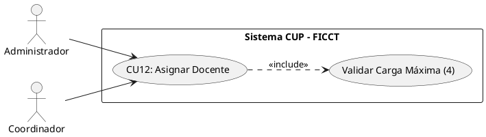
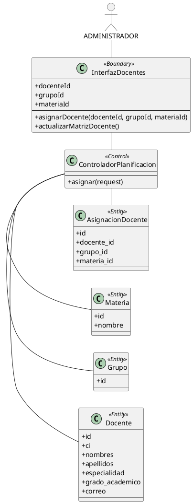
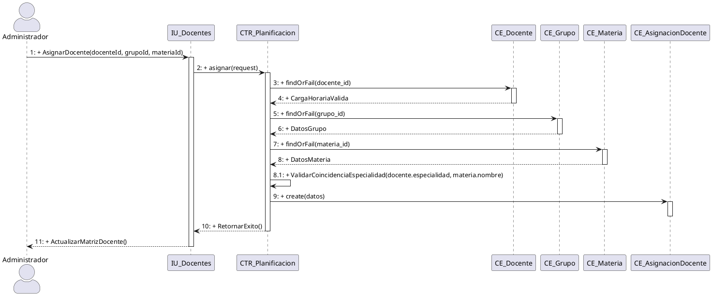
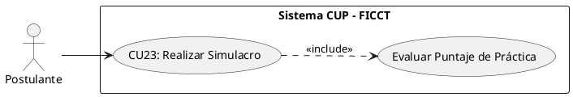
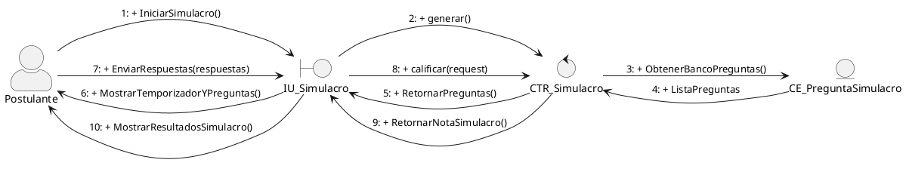
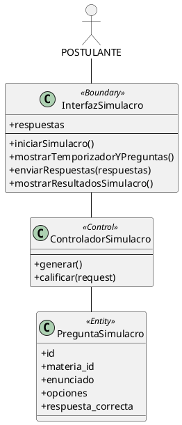
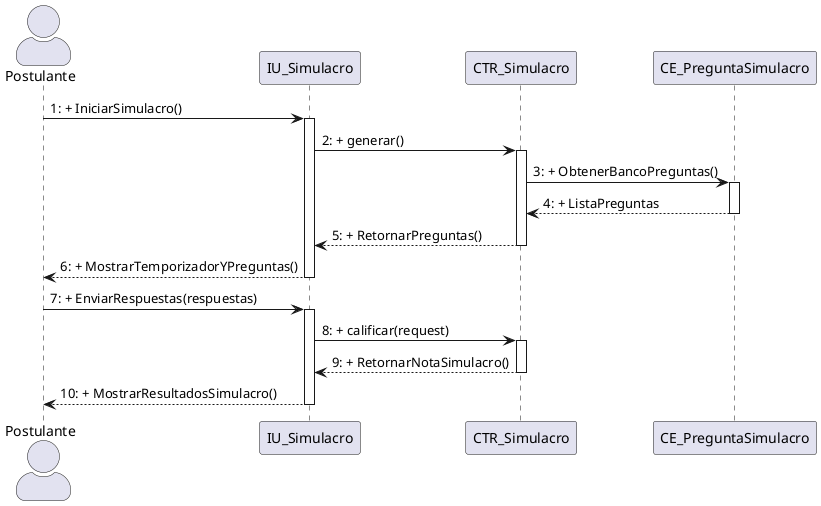

necesito que corrigas todos estos casos de uso basandote en lo siguiente :
#### CU12: Asignar Docente a Grupo y Materia

**A. Estructura del Modelo de CU (Diagrama Específico)**

**B. Ficha de Especificación del Caso de Uso**
                
| **CASO DE USO**     | CU12 — Asignar Docente a Grupo y Materia.
| **PROPÓSITO**       | Vincular a cada docente del CUP con los grupos y materias que impartirá, controlando que no exceda su carga máxima de 4 grupos. 
| **DESCRIPCIÓN**     | El Administrador o Coordinador selecciona un docente registrado, elige el grupo y la materia a asignar. El sistema verifica automáticamente que el docente no tenga ya 4 grupos asignados y que el grupo no tenga ya un docente para esa materia. Cada grupo requiere 4 docentes (uno por materia: Computación, Matemáticas, Inglés, Física). 
| **ACTORES**         | Tablas de BD (`docentes`, `grupos`, `asignaciones_docente`). 
| **ACTOR INICIADOR** | Administrador o Coordinador Académico. 
| **PRECONDICIÓN**    | Los grupos deben existir (CU10). El docente debe estar registrado y activo.
| **FLUJO PRINCIPAL** | 1. El actor ingresa al módulo "Gestión de Docentes" → "Asignaciones". 2. El sistema despliega la lista de docentes activos con su carga actual (grupos asignados / 4). 3. El actor selecciona un docente y presiona "Asignar a Grupo". 4. El sistema despliega los grupos disponibles y las materias sin docente asignado. 5. El actor selecciona el grupo y la materia correspondiente a la especialidad del docente. 6. El sistema verifica que el docente no tenga 4 grupos (carga máxima) y que el grupo no tenga ya un docente para esa materia. 7. El sistema registra la asignación y actualiza la carga horaria del docente. 8. Si el docente alcanza 4 grupos, el sistema muestra una alerta visual y envía una notificación al Coordinador. |
| **POST CONDICIÓN**  | El docente queda vinculado al grupo y materia. Solo podrá ver y evaluar a los postulantes de sus grupos asignados.
| **EXCEPCIONES**     | *E1: Carga máxima alcanzada.* "El docente [nombre] ya tiene 4 grupos asignados. No puede asumir más grupos". *E2: Grupo ya tiene docente para esa materia.* "El Grupo [N] ya tiene un docente asignado para [materia]". *E3: Especialidad no coincide.* Advertencia: "El docente [nombre] tiene especialidad en [X] pero se le está asignando [Y]. ¿Confirmar?".

#### Realización de Análisis para CU12: Asignar Docente a Grupo (Diagrama de comunicacion)

**Descripción detallada de la colaboración y dinámica:**
El flujo inicia cuando el actor *Administrador* interactúa con la `InterfazDocentes`. La frontera delega al `ControladorPlanificacion`, el cual verifica la carga horaria del docente, valida la existencia del grupo en la entidad `CE_Grupo`, valida su especialidad contra la materia solicitada y registra la asignación en la entidad `AsignacionDocente`.

##### CU12: Asignar Docente a Grupo y Materia (DIAGRAMA DE ANALISIS)

#### 12. Diagrama de Secuencia para CU12: Asignar Docente a Grupo y Materia

FIN DEL CASO DE USO 12

COMIENZO DEL CASO DE USO 23

#### CU23: Realizar Simulacro de Examen (Práctica)

**A. Estructura del Modelo de CU (Diagrama Específico)**

**B. Ficha de Especificación del Caso de Uso**

| **CASO DE USO**     | CU23 — Realizar Simulacro de Examen (Práctica). 
| **PROPÓSITO**       | Proveer al postulante una herramienta de preparación que no afecte su nota oficial, permitiéndole familiarizarse con el formato del examen y medir sus conocimientos previos. 
| **DESCRIPCIÓN**     | El postulante inscrito puede acceder a un banco de preguntas aleatorias para las 4 materias. El sistema genera un examen simulado de 40 preguntas, provee un temporizador y al finalizar calcula el puntaje obtenido. Los resultados son puramente informativos y no se guardan en el historial académico oficial del postulante. 
| **ACTORES**         | Tablas de BD (`preguntas_simulacro`).
| **ACTOR INICIADOR** | Postulante.
| **PRECONDICIÓN**    | El postulante debe tener estado "Inscrito" (CU07 completado). 
| **FLUJO PRINCIPAL** | 1. El postulante ingresa al módulo "Área de Práctica". 2. El sistema despliega las instrucciones del simulacro. 3. El postulante presiona "Iniciar Simulacro". 4. El sistema selecciona aleatoriamente 40 preguntas del banco de preguntas de práctica (10 por cada materia). 5. El sistema muestra la interfaz de examen con un temporizador (ej. 60 minutos). 6. El postulante responde las opciones de selección múltiple. 7. El postulante presiona "Finalizar" o el tiempo expira. 8. El sistema evalúa automáticamente las respuestas y muestra el puntaje obtenido detallado por materia. |
| **POST CONDICIÓN**  | El postulante recibe su retroalimentación. La base de datos de notas oficiales no sufre ninguna alteración. 
| **EXCEPCIONES**     | *E1: Banco de preguntas vacío.* "El módulo de práctica no está disponible en este momento". 

#### Realización de Análisis para CU23: Realizar Simulacro de Examen (diagrama de comunicacion)

**Descripción detallada de la colaboración y dinámica:**
El flujo inicia cuando el actor *Postulante* interactúa con la `InterfazSimulacro`. La frontera delega al `ControladorSimulacro`, el cual obtiene preguntas aleatorias de la entidad `PreguntaSimulacro`, las presenta con temporizador, recibe las respuestas y califica el resultado devolviendo la nota simulada.

##### CU23: Realizar Simulacro de Examen (Práctica) (DIAGRAMA DE ANALISIS)

#### 23. Diagrama de Secuencia para CU23: Realizar Simulacro de Examen (Práctica)

FIN DEL CASO DE USO 23
