necesito que corrigas todos estos casos de uso basandote en lo siguiente :
#### CU13: Registrar Notas de Examen por el Administrador (Individual)

**A. Estructura del Modelo de CU (Diagrama Específico)**

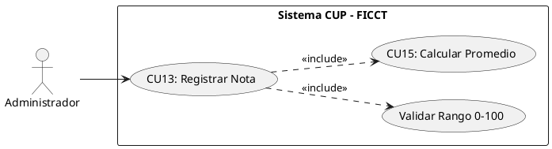

**B. Ficha de Especificación del Caso de Uso**

| **CASO DE USO**     | CU13 — Registrar Notas de Examen por el Administrador (Individual).
| **PROPÓSITO**       | Actuar como mecanismo de excepción para que el Administrador registre o corrija la calificación individual de un examen (ej. rezagados, correcciones manuales o fallos técnicos en la BD local).
| **DESCRIPCIÓN**     | El Administrador selecciona un grupo, una materia y un número de examen (1, 2 o 3). El sistema despliega la lista de postulantes y permite ingresar la nota individual. Este CU se usa principalmente para correcciones, ya que el flujo normal es la carga masiva (CU14). Tras el registro, el sistema recalcula automáticamente el promedio ponderado de la materia (CU15).
| **ACTORES**         | Tablas de BD (`examenes`, `postulantes`, `asignaciones_grupo`). 
| **ACTOR INICIADOR** | Administrador del Sistema. 
| **PRECONDICIÓN**    | Los postulantes deben estar asignados al grupo (CU11).   
| **FLUJO PRINCIPAL** | 1. El Administrador ingresa al módulo "Calificaciones". 2. Selecciona un grupo y materia. 3. El sistema despliega la lista de postulantes con columnas: Examen 1, Examen 2, Examen 3, Promedio Ponderado. 4. El Administrador selecciona el número de examen a calificar (1, 2 o 3). 5. Ingresa la nota (0-100) para el postulante excepcionado. 6. El sistema valida el rango. 7. El sistema guarda la nota y ejecuta `<<include>> CU15`: recalcula el promedio ponderado. 8. El sistema actualiza visualmente la columna correspondiente. |
| **POST CONDICIÓN**  | La nota queda registrada con auditoría (administrador, fecha, hora). El promedio ponderado se recalcula automáticamente.
| **EXCEPCIONES**     | *E1: Nota fuera de rango.* "La nota debe estar entre 0 y 100". *E2: Examen ya calificado.* "Este examen ya fue registrado. Use la función de edición para modificarlo". *E3: 4° examen bloqueado.* El sistema no permite registrar un cuarto examen por materia.

#### Realización de Análisis para CU13: Registrar Notas de Examen (Individual)  (diagrama de comunicacion)

**Descripción detallada de la colaboración y dinámica:**
El flujo inicia cuando el actor *Administrador* interactúa con la `InterfazNotas`. La frontera solicita la acción al controlador correspondiente, el cual orquesta la lógica de negocio, consulta o actualiza las entidades involucradas y devuelve el resultado a la interfaz para informar al usuario. Cada cambio de notas se registra en la entidad `CE_AuditoriaNotas` para su auditoría.

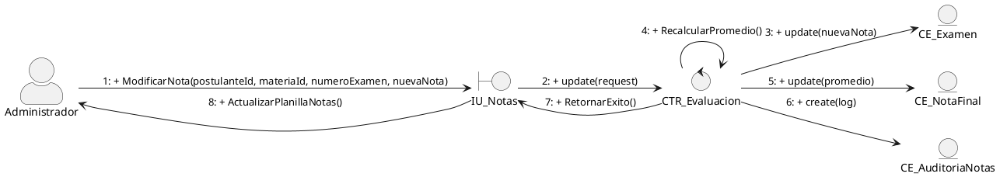
#### Diagramas de Análisis de Clases por Caso de Uso (Ciclo 2)

##### CU13: Registrar Notas de Examen por el Administrador (Individual)
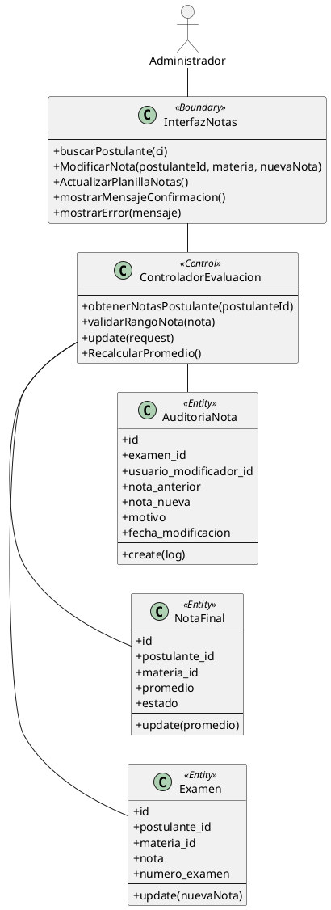

#### 13. Diagrama de Secuencia para CU13: Registrar Notas (Individual)

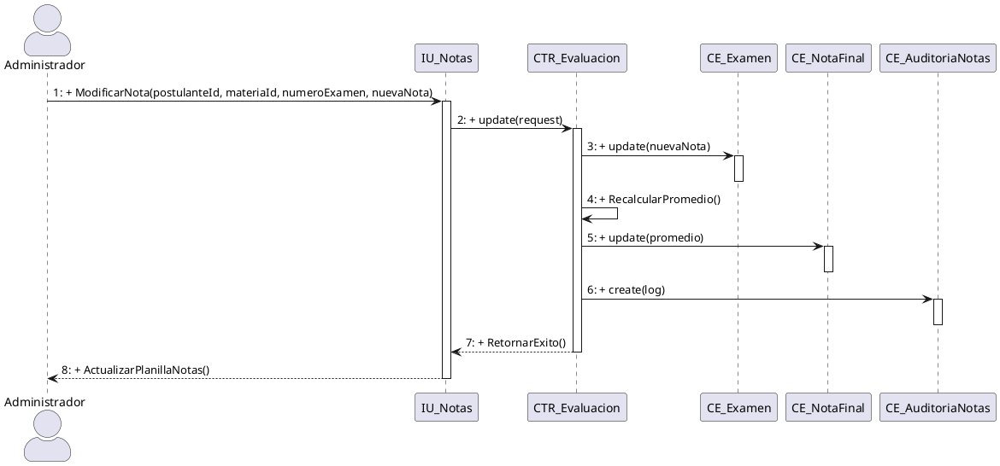
fin del caso de uso 13

comienza caso de uso 14
#### CU14: Cargar Notas Masivamente por el Administrador (CSV/Excel)

**A. Estructura del Modelo de CU (Diagrama Específico)**

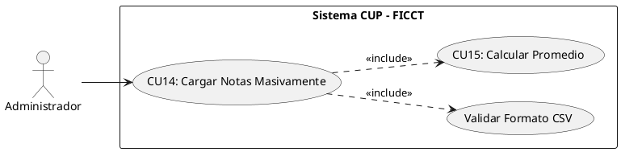

**B. Ficha de Especificación del Caso de Uso**

| **CASO DE USO**     | CU14 — Cargar Notas Masivamente por el Administrador (CSV/Excel).
| **PROPÓSITO**       | Integrar los resultados de evaluación generados automáticamente por los laboratorios de cómputo, permitiendo subir directamente los archivos CSV exportados sin digitación manual. 
| **DESCRIPCIÓN**     | El Administrador recibe los archivos CSV exportados por las Bases de Datos locales de los laboratorios y los sube directamente al sistema central. El sistema parsea el archivo, valida que los IDs coincidan con los postulantes y confirma la carga masiva.  
| **ACTORES**         | Tablas de BD (`examenes`, `postulantes`). 
| **ACTOR INICIADOR** | Administrador del Sistema.
| **PRECONDICIÓN**    | Los postulantes deben estar asignados a grupos. El archivo CSV debe coincidir con la estructura esperada por el sistema.
| **FLUJO PRINCIPAL** | 1. El Administrador ingresa a "Calificaciones" → "Carga Masiva". 2. Selecciona el archivo CSV recibido desde el laboratorio de cómputo. 3. Sube el archivo CSV al sistema. 4. El sistema parsea el archivo y ejecuta validaciones: códigos existentes, notas en rango 0-100, no duplicidad. 5. El sistema muestra un resumen: "N registros válidos, M errores". 6. El Administrador confirma. 7. El sistema inserta las notas masivamente (CU15). |
| **POST CONDICIÓN**  | Todas las notas válidas quedan registradas y centralizadas en la BD principal. 
| **EXCEPCIONES**     | *E1: Archivo vacío o formato incorrecto.* "El archivo no cumple con el formato esperado". *E2: Notas duplicadas.* "Se detectaron [N] notas duplicadas que serán omitidas". 

#### Realización de Análisis para CU14: Cargar Notas Masivamente (CSV) (diagrama de comunicacion)

**Descripción detallada de la colaboración y dinámica:**
El *Administrador* selecciona un archivo de notas plano exportado de los laboratorios locales y lo carga mediante la `InterfazNotas`. Esta frontera transmite el archivo al `ControladorEvaluacion`, el cual abre una transacción y realiza un ciclo de lectura sobre las filas del CSV. Para cada registro, consulta la existencia del estudiante en la entidad `Postulante` mediante su CI. Si es válido, inserta o actualiza la nota correspondiente en la entidad `Examen` (registrando materia y número de examen). El controlador ejecuta la fórmula de ponderación (30% Ex1 + 30% Ex2 + 40% Ex3) y persiste el promedio en la entidad `NotaFinal` junto a su estado (APROBADO/REPROBADO), verificando que la aprobación sea individual por materia. Cada inserción y actualización es anotada en la entidad de auditoría `CE_AuditoriaNotas` (mapeada a `auditoria_notas` en la base de datos) para mitigar riesgos de manipulación indebida de calificaciones.

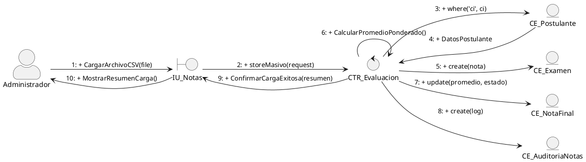

##### CU14: Cargar Notas Masivamente (CSV) (diagrama de analisis)
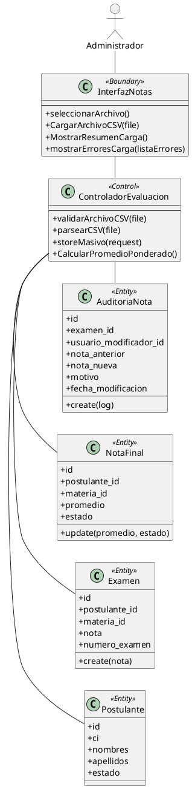

#### 14. Diagrama de Secuencia para CU14: Cargar Notas Masivamente (CSV)

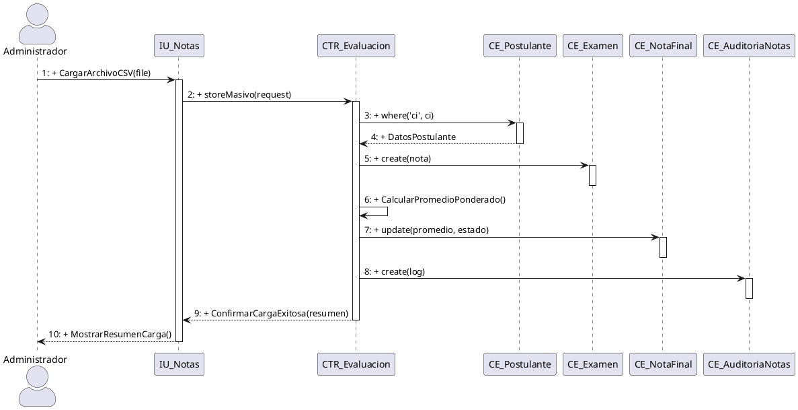
fin del caso de uso 14 

comienza caso de uso 15
#### CU15: Calcular Promedio Ponderado por Materia

**A. Estructura del Modelo de CU (Diagrama Específico)**

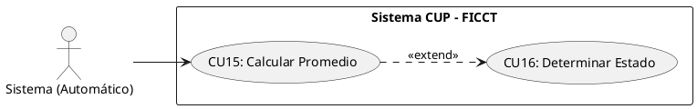

**B. Ficha de Especificación del Caso de Uso**

| **CASO DE USO**     | CU15 — Calcular Promedio Ponderado por Materia. 
| **PROPÓSITO**       | Aplicar automáticamente la fórmula de ponderación (30%-30%-40%) para determinar la nota final de cada materia de cada postulante. 
| **DESCRIPCIÓN**     | El sistema calcula automáticamente el promedio ponderado cada vez que se registra o modifica una nota de examen. La fórmula aplicada es: `Nota_Final_Materia = (Examen1 × 0.30) + (Examen2 × 0.30) + (Examen3 × 0.40)`. Las ponderaciones son configurables por el Administrador.
| **ACTORES**         | Tablas de BD (`examenes`, `notas_finales`).
| **ACTOR INICIADOR** | Sistema (invocado automáticamente desde CU13 o CU14). 
| **PRECONDICIÓN**    | Debe existir al menos una nota registrada para el postulante en la materia.
| **FLUJO PRINCIPAL** | 1. El sistema detecta un INSERT o UPDATE en la tabla `examenes`. 2. El sistema recupera las notas registradas del postulante para esa materia. 3. Si las 3 notas están presentes: aplica la fórmula ponderada completa. 4. Si faltan notas: calcula un promedio parcial indicando "(Incompleto — faltan N exámenes)". 5. El sistema almacena el resultado en la tabla `notas_finales` (postulante, materia, nota_final, estado). 6. El sistema invoca CU16 si las 4 materias tienen nota final completa. |
| **POST CONDICIÓN**  | La nota final ponderada queda registrada y visible para docentes, coordinadores y el postulante.
| **EXCEPCIONES**     | Ninguna. El cálculo es determinístico y automático. 
**Ejemplo de cálculo:**

| Materia     | Examen 1 (30%)   | Examen 2 (30%)   | Examen 3 (40%) | Nota Final |
| ----------- | ---------------- | ---------------- | -------------- | ---------- |
| Computación | 80 × 0.30 = 24   | 70 × 0.30 = 21   | 90 × 0.40 = 36 | **81.0** ✅ |
| Matemáticas | 50 × 0.30 = 15   | 55 × 0.30 = 16.5 | 60 × 0.40 = 24 | **55.5** ❌ |
| Inglés      | 75 × 0.30 = 22.5 | 80 × 0.30 = 24   | 85 × 0.40 = 34 | **80.5** ✅ |
| Física      | 60 × 0.30 = 18   | 65 × 0.30 = 19.5 | 70 × 0.40 = 28 | **65.5** ✅ |

> **Resultado:** REPROBADO — Matemáticas (55.5) no alcanza el ≥60 requerido por materia.

#### Realización de Análisis para CU15: Calcular Promedio Ponderado (diagrama de comunicacion)

**Descripción detallada de la colaboración y dinámica:**
El flujo inicia cuando el programador de tareas (actor *Sistema*) ejecuta la tarea programada a través de la interfaz de línea de comandos (`Artisan_Console`). La consola solicita la acción al controlador correspondiente, el cual orquesta la lógica de negocio, consulta o actualiza las entidades involucradas y devuelve el resultado a la consola para su registro.

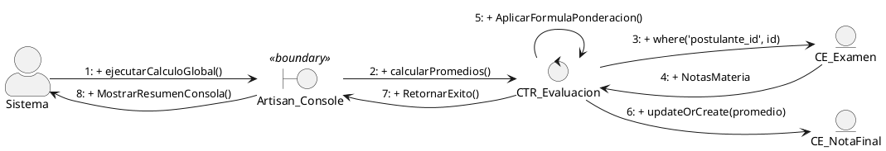

##### CU15: Calcular Promedio Ponderado (diagrama de analisis)
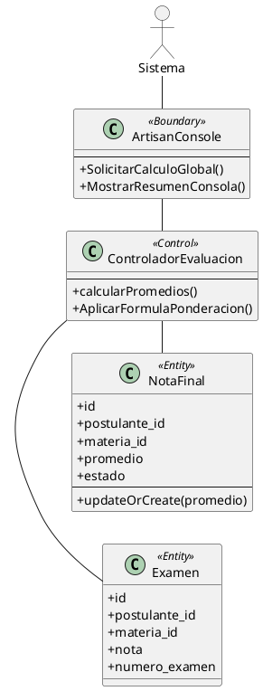

#### 15. Diagrama de Secuencia para CU15: Calcular Promedio Ponderado

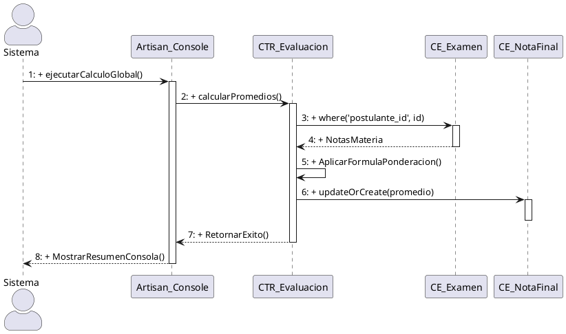
fin del caso de uso 15

comienzo del caso de uso 16

#### CU16: Determinar Estado del Postulante (Aprobado/Reprobado)

**A. Estructura del Modelo de CU (Diagrama Específico)**

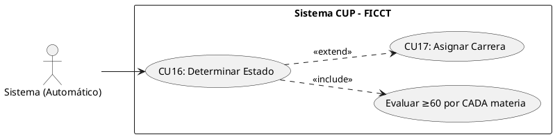

**B. Ficha de Especificación del Caso de Uso**

| **CASO DE USO**     | CU16 — Determinar Estado del Postulante (Aprobado/Reprobado). 
| **PROPÓSITO**       | Aplicar sistémicamente la regla de negocio de aprobación del CUP: el postulante debe obtener ≥60 en CADA una de las 4 materias individualmente para ser considerado APROBADO. 
| **DESCRIPCIÓN**     | Una vez que las 4 materias del postulante tienen nota final calculada (CU15), el sistema evalúa automáticamente la regla de negocio. **NO se utiliza el promedio general de las 4 materias.** Cada materia se evalúa de forma independiente. Si TODAS las materias tienen nota final ≥60, el estado es APROBADO. Si al menos UNA materia tiene nota final <60, el estado es REPROBADO. 
| **ACTORES**         | Tablas de BD (`notas_finales`, `postulantes`). 
| **ACTOR INICIADOR** | Sistema (invocado automáticamente tras completar CU15 para las 4 materias). 
| **PRECONDICIÓN**    | Las 4 materias del postulante deben tener nota final calculada (los 3 exámenes por materia registrados). 
| **FLUJO PRINCIPAL** | 1. El sistema detecta que las 4 materias del postulante tienen nota final completa. 2. El sistema evalúa cada nota final individualmente contra el umbral ≥60. 3. **Si las 4 materias ≥60:** El sistema actualiza el estado del postulante a "APROBADO". El sistema envía una notificación al postulante y al coordinador. El sistema invoca `<<extend>> CU17` para la asignación de carrera. 4. **Si alguna materia <60:** El sistema actualiza el estado a "REPROBADO" indicando las materias no aprobadas. El sistema envía una notificación al postulante con el detalle de las materias reprobadas. |
| **POST CONDICIÓN**  | El estado del postulante queda determinado de forma inmutable (solo el Administrador puede corregir en caso de error de digitación).
| **EXCEPCIONES**     | Ninguna. La regla es determinística e inquebrantable por diseño. 

**Regla de negocio implementada:**

```
PARA cada postulante CON 4 materias evaluadas:
  SI nota_final_computacion >= 60
     Y nota_final_matematicas >= 60
     Y nota_final_ingles >= 60
     Y nota_final_fisica >= 60:
    → Estado = APROBADO
  SINO:
    → Estado = REPROBADO
    → Registrar materias reprobadas (las que tienen < 60)
FIN PARA
```
> ⚠️ **IMPORTANTE:** La regla de negocio establece que el umbral ≥60 se aplica a CADA materia individualmente. NO al promedio general de las 4 materias. Un postulante con notas 100, 100, 90, 55 queda REPROBADO porque una materia (55) no alcanza el umbral, aunque su promedio general sea 86.25.

#### Realización de Análisis para CU16: Determinar Estado (Aprobado/Reprobado) (diagrama de comunicacion)

**Descripción detallada de la colaboración y dinámica:**
El flujo inicia cuando el programador de tareas (actor *Sistema*) ejecuta la tarea programada a través de la interfaz de línea de comandos (`Artisan_Console`). La consola solicita la acción al controlador correspondiente, el cual orquesta la lógica de negocio, consulta o actualiza las entidades involucradas y devuelve el resultado a la consola para su registro.

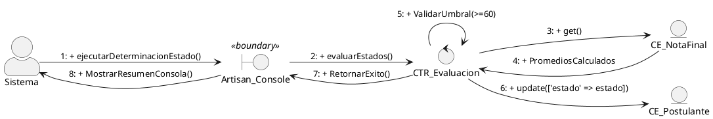
##### CU16: Determinar Estado (Aprobado/Reprobado) (diagrama de analisis)
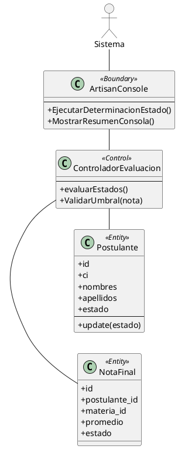
#### 16. Diagrama de Secuencia para CU16: Determinar Estado (Aprobado/Reprobado)

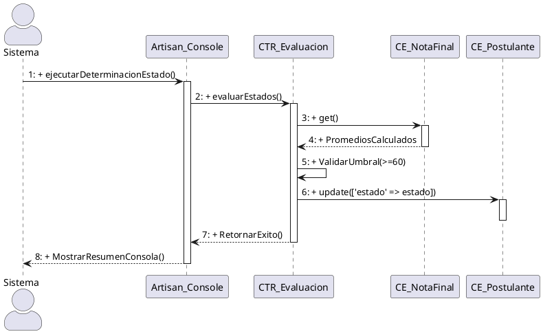

fin del caso de uso 16

comienza el caso de uso 17
#### CU17: Ejecutar Asignación de Carreras por Cupo

**A. Estructura del Modelo de CU (Diagrama Específico)**

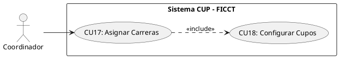

**B. Ficha de Especificación del Caso de Uso**
 
| **CASO DE USO**     | CU17 — Ejecutar Asignación de Carreras por Cupo.
| **PROPÓSITO**       | Asignar a los postulantes aprobados a su carrera correspondiente según sus preferencias y la disponibilidad de cupos vigentes por gestión.
| **DESCRIPCIÓN**     | El Coordinador ejecuta el algoritmo de asignación masiva de carreras. El sistema recorre la lista de postulantes aprobados (ordenados por promedio general descendente), intentando asignar primero la 1ª opción de carrera. Si los cupos están agotados, intenta la 2ª opción. Si ambas están llenas, marca al postulante como "Pendiente de Reasignación". 
| **ACTORES**         | Tablas de BD (`postulantes`, `carreras`, `cupos_gestion`, `admisiones`). 
| **ACTOR INICIADOR** | Coordinador Académico.
| **PRECONDICIÓN**    | Los estados de todos los postulantes deben estar determinados (CU16). Los cupos por carrera deben estar configurados (CU18).
| **FLUJO PRINCIPAL** | 1. El Coordinador ingresa al módulo "Admisión" → "Asignar Carreras". 2. El sistema muestra el resumen: "Aprobados: [N]. Cupos totales disponibles: [M]". 3. El Coordinador presiona "Ejecutar Asignación". 4. El sistema ordena los aprobados por promedio general descendente. 5. Para cada aprobado: verifica cupo en 1ª opción → asigna; si no hay → verifica 2ª opción → asigna; si no hay → marca "Pendiente". 6. El sistema muestra el resultado detallado con métricas. 7. El sistema envía notificaciones a cada postulante aprobado indicando la carrera asignada. |
| **POST CONDICIÓN**  | Los postulantes aprobados quedan asignados a una carrera. Los cupos se descuentan atómicamente.
| **EXCEPCIONES**     | *E1: Ambas opciones agotadas.* El postulante queda como "Pendiente de Reasignación Administrativa". Se notifica al Coordinador para resolución manual (asignar a la carrera con menor cantidad de inscritos).

#### Realización de Análisis para CU17: Asignar Carreras por Cupo (diagrama de comunicacion)

**Descripción detallada de la colaboración y dinámica:**
El *Coordinador* de la facultad inicia el algoritmo masivo desde la `InterfazAdmision`. El `ControladorAsignacionCarrera` inicia una transacción aislada en base de datos. Consulta en la entidad `Postulante` y sus relaciones para obtener a todos los postulantes con estado global "Aprobado", ordenados de forma descendente por su promedio general general (garantizando el principio de meritocracia). Para cada postulante aprobado, el controlador consulta a la entidad `CupoGestion` para evaluar la disponibilidad de plazas en su carrera de primera opción. Si existen vacantes, crea un registro de ingreso en la entidad `Admision` y decrementa el stock de cupos en `CupoGestion`. Si la primera opción se encuentra agotada, repite la validación contra su segunda opción de carrera. En caso de que ambas opciones estén saturadas de postulantes con mejores calificaciones, el controlador actualiza el estado del postulante a "Pendiente Reasignacion" y dispara un log de advertencia en `BitacoraAcceso` para su posterior evaluación manual.

```plantuml
@startuml Com_CU17
left to right direction
skinparam actorStyle awesome
skinparam backgroundColor transparent

actor "Coordinador" as Act
boundary "IU_Admision" as B_Admi
control "CTR_AsignacionCarrera" as C_Asig
entity "CE_Postulante" as E_Post
entity "CE_CupoGestion" as E_Cupo
entity "CE_Admision" as E_Admi
entity "CE_BitacoraAcceso" as E_Bit

Act --> B_Admi : 1: + ProcesarAsignacionCarreras()
B_Admi --> C_Asig : 2: + asignacionMasiva()
C_Asig --> E_Post : 3: + getAprobados()
E_Post --> C_Asig : 4: + ListaAprobados

C_Asig --> E_Cupo : 5 [Loop]: + where('carrera_id', primera_opcion_id)
E_Cupo --> C_Asig : 6 [Loop]: + CupoDisponible1raOpcion

C_Asig --> E_Admi : 7a [Loop, Cupo1ra > 0]: + create(postulante, carrera_1ra, via='1ra Opcion')
C_Asig --> E_Cupo : 8a [Loop, Cupo1ra > 0]: + decrement(cupos_disponibles)

C_Asig --> E_Cupo : 7b [Loop, Cupo1ra = 0]: + where('carrera_id', segunda_opcion_id)
E_Cupo --> C_Asig : 8b [Loop, Cupo1ra = 0]: + CupoDisponible2daOpcion

C_Asig --> E_Admi : 9b [Loop, Cupo2da > 0]: + create(postulante, carrera_2da, via='2da Opcion')
C_Asig --> E_Cupo : 10b [Loop, Cupo2da > 0]: + decrement(cupos_disponibles)

C_Asig --> E_Post : 9c [Loop, Cupos Agotados]: + update(['estado' => 'Pendiente Reasignacion'])
C_Asig --> E_Bit : 10c [Loop, Cupos Agotados]: + create(log_alerta)

C_Asig --> B_Admi : 11: + ConfirmarProcesamientoExito()
B_Admi --> Act : 12: + MostrarResultadosYAlertas()
@enduml
```

##### CU17: Asignar Carreras por Cupo (diagrama de analisis)
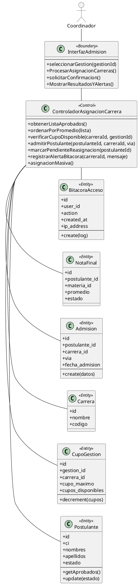

#### 17. Diagrama de Secuencia para CU17: Asignar Carreras por Cupo (Algoritmo de Admisión)

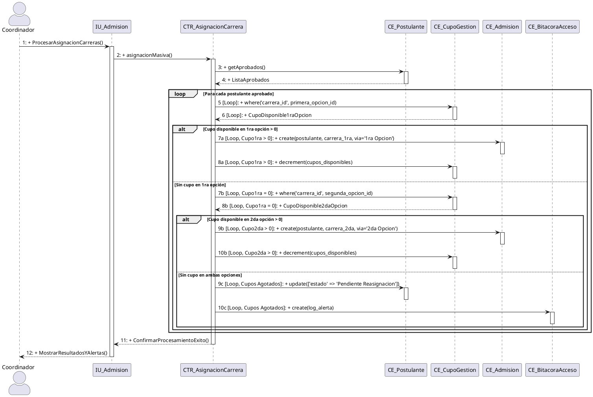
fin del caso de uso 17
